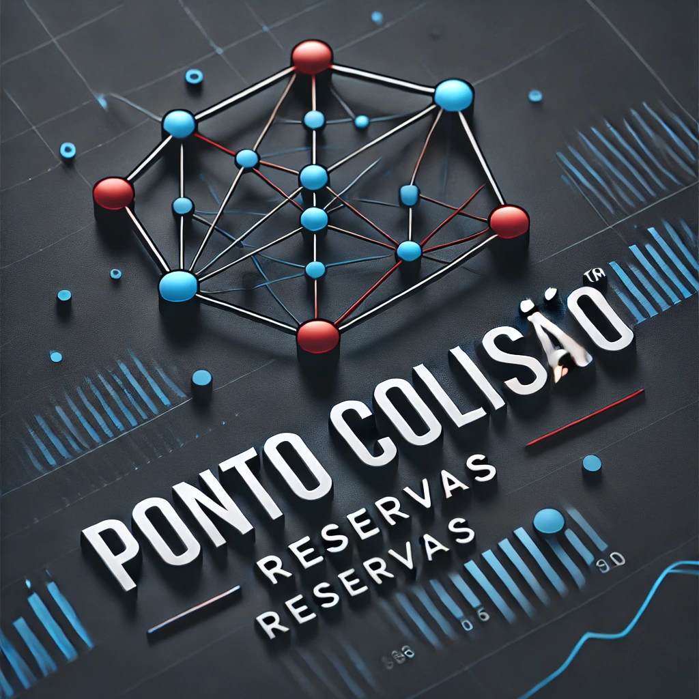
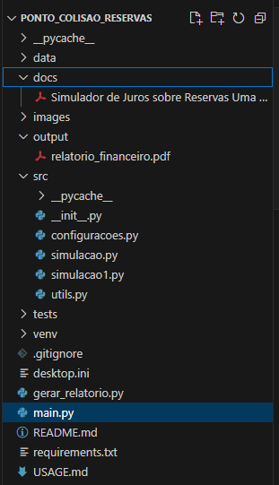
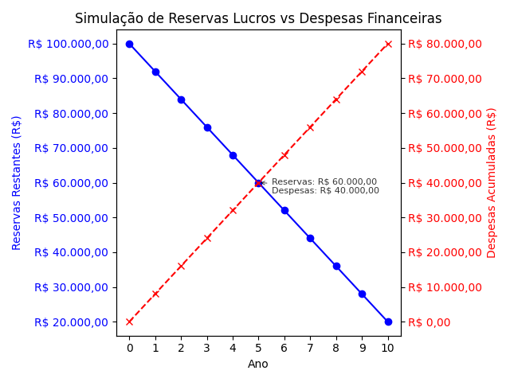
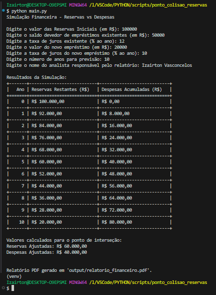
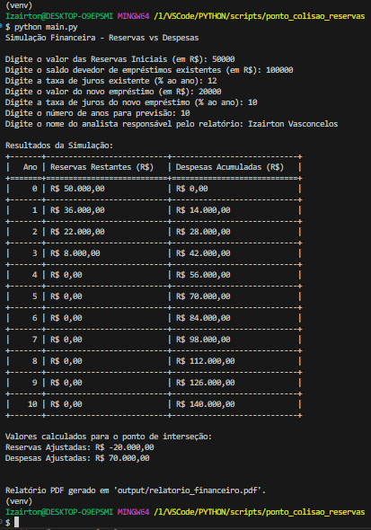

# 🗂️ Projeto: ponto_colisao_reservas

## 📝 Descrição

Este projeto é um simulador financeiro que auxilia administradores e analistas a compreenderem a relação entre **reservas financeiras** e **despesas acumuladas** ao longo do tempo. Ele calcula e ilustra o **ponto crítico de colisão financeira**, quando despesas acumuladas superam as reservas restantes.

## 🎯 Objetivo do Projeto

O objetivo principal deste projeto é proporcionar uma ferramenta prática para **análise de risco financeiro**, permitindo prever situações críticas de **insolvência** e oferecendo suporte na tomada de decisões estratégicas.

## 🚀 Funcionalidades

- **Simulação de Reservas vs Despesas:** Analisa o comportamento das reservas financeiras e despesas ao longo do tempo.
- **Identificação do Ponto Crítico:** Calcula e destaca o momento em que despesas acumuladas superam as reservas.
- **Relatório PDF Profissional:** Gera relatórios claros e detalhados, incluindo parecer técnico.
- **Visualização Gráfica:** Criação de gráficos bidimensionais para melhor compreensão dos dados.

## 📂 Estrutura do Projeto

Abaixo está uma visualização da estrutura do projeto:

## 🏆 Benefícios do Simulador

- **Precisão:** Reduz erros manuais em cálculos financeiros.
- **Eficiência:** Automatiza análises complexas, economizando tempo.
- **Clareza:** Proporciona insights detalhados por meio de tabelas, gráficos e relatórios.

## 🖥️ Como Executar

1. Clone o repositório:

   git clone <https://github.com/IOVASCON/ponto_colisor_reservas.git>

2. Navegue até o diretório do projeto:

   cd ponto_colisao_reservas

3. Configure o ambiente virtual (se necessário):

   python3 -m venv venv
   source venv/bin/activate  # Linux/Mac/Git Bash
   venv\Scripts\activate  # Windows

4. Instale as dependências:

   pip install -r requirements.txt

5. Execute o programa principal:

   python main.py

## 💻 Ambiente Virtual

Ambiente virtual configurado: **Sim** (utilizando requirements.txt)

## 📦 Bibliotecas Utilizadas

As bibliotecas identificadas no projeto são:

fpdf==1.7.2
matplotlib==3.10.0
numpy==2.2.2
pandas==2.2.3
tabulate==0.9.0

## 🚀 Tecnologias Utilizadas

As principais tecnologias utilizadas no projeto incluem:

- [Python]<https://www.python.org/>
- Python
- Matplotlib
- FPDF
- Pandas
- Outras tecnologias podem ser descritas aqui.

## 🛠️ Tarefas

- [X] Implementar identificação do ponto crítico.
- [X] Gerar gráficos com interseção destacada.
- [X] Criar relatórios profissionais em PDF.
- [ ] Adicionar suporte para exportação em Excel.
- [ ] Criar interface web para o simulador.

    dor.

## 🖥️ Como Funciona

### Entradas do Usuário

- Reservas Iniciais: Total de recursos financeiros disponíveis.
- Empréstimos Existentes: Saldo devedor de contratos vigentes.
- Taxas de Juros: Percentuais aplicados aos empréstimos existentes e novos.
- Previsão em Anos: Horizonte temporal para a análise.

### Resultados

- Tabela no Terminal: Mostra as reservas restantes e despesas acumuladas para cada ano.
- Gráfico: Exibe visualmente o comportamento das reservas e despesas ao longo do tempo, destacando o ponto de interseção.
- Relatório PDF: Apresenta um parecer técnico detalhado e tabelas de resultados.

## 📘 Conceitos Financeiros

### Reservas e Despesas

As reservas financeiras representam o "caixa disponível" da empresa. Já as despesas financeiras incluem juros e pagamentos de contratos. O projeto ilustra como reservas e despesas estão interligadas e destaca a necessidade de um gerenciamento eficaz para evitar insolvência.

### Ponto Crítico

É o momento em que despesas acumuladas superam as reservas, sinalizando risco de falência. A simulação evidencia esse ponto, permitindo ações preventivas.

📊 Situações Simuladas

1. Reservas Positivas:

2. Reservas Negativas:

## 🤔 Importância do Python

O Python é essencial no projeto, permitindo:

- Automação de Cálculos: Precisão em análises complexas.
- Visualização: Gráficos claros e informativos.
- Documentação: Relatórios profissionais em PDF.

## 🗂️ Histórico de Lançamento

    1.0.0
        - Lançamento inicial com todas as funcionalidades principais.

## 🗂️ Imagens do Simulador

## 🤝 Contribuições

Feedbacks e sugestões são sempre bem-vindos! Sinta-se à vontade para abrir [**issues**]<https://github.com/IOVASCON/ponto_colisor_reservas.git/issues> ou enviar [**pull requests**]<https://github.com/IOVASCON/ponto_colisor_reservas.git/pulls>.

Espero que este README seja útil para explicar o projeto e atrair atenção de colaboradores e usuários. Se precisar de ajustes ou personalizações, é só avisar! 🚀

## 👥 Autor

- [@iovascon]<https://github.com/IOVASCON/ponto_colisor_reservas.git>

## 📜 Licença

Este projeto está sob a licença [MIT]<https://opensource.org/licenses/MIT>.
